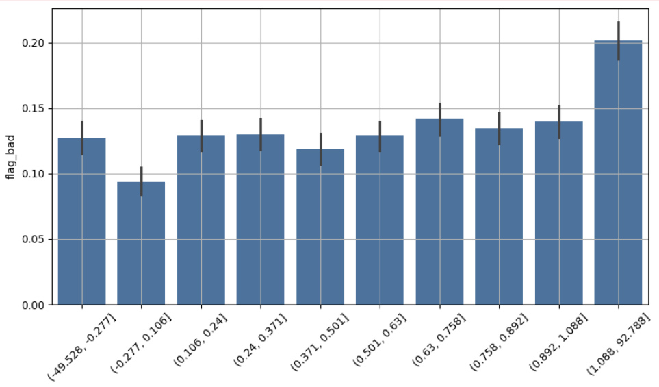
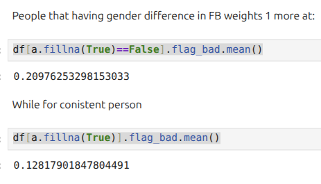
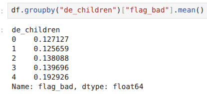
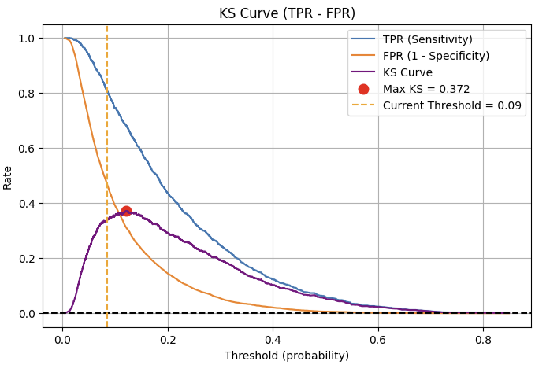
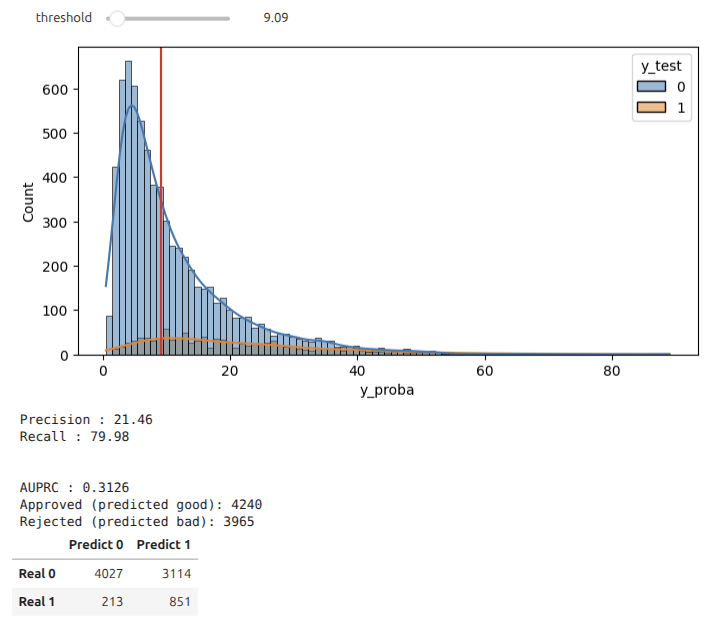

# Bad Loan Prediction

In this project we will try to predict flag bad based on several features. We will also do lot of feature engineering. 

### Slides

[View Presentation](https://docs.google.com/presentation/d/1bTWVKUndCJmqCgKBjqZI0zwOdDYtS8K9bzRzUUV4K6w/edit?usp=sharing)

### Files

In the project we have 3 main notebook:

- device.ipynb - Notebook for feature eningeering the device. Here we will curate data we have to match the gsmarena external dataset's model and oem key to gain more data.
- EDA.ipynb - Exploratory data analysis of the dataset. Here we unlock several pattern from the data.
- FE & Modelling.ipynb - In this notebook we try to do feature engineering and modelling to the dataset. We also try different model and also doing fine tuning to the model.

There are also several external data and curated data attached:

- convert.csv - data of conversion of codename to marketing name
- gsm.csv - gsmarena dataset we get from kaggle
- marketing_gsm_clean.csv - final curated data that has been joined that has key to our internal dataset

There are also archive datasets:

- phone_marketing_name_initial.csv - pre-curated dataset
- phone_marketing_name.csv - post-curated dataset

### Several Key Insights From EDA

- The discrepancies between the age based on FB date of birth relatife to date joined compared to de_age is affecting the flag bad composition.

- The difference of fb_gender and de_gender also increasing the bad composition relative to the non different one

- The more the children, the more flag bad composition

- And more at EDA.ipynb

### Modelling

We try to use xgboost and lightgbm model. After getting the best model, we continue to fine tune it.

### Evaluation

#### AUPRC

We will use area under precision recall curve to gain more insight to the data. After that we will take recall level by asumption and see the precision under threshold we take.

#### KS & Logloss

Besides, in fintech we should also measure KS and logloss.

- KS : Good for ranking e.g. use case when your CA only can asses 100 applicants a day or your sales only can visit 100 house a day. KS is threshold-independent, means its a property of one set of model/tuned. In general: < 0.20 → Poor discriminatory power (model is barely better than random). | 0.20 – 0.40 → Fair model | 0.40 – 0.60 → Good model | > 0.60 Very strong, rarely seen in production credit risk models (often signals overfitting if seen in development).

KS itself is:

$$
KS = max(tpr-fpr)
$$

Range [0,1] the bigger the better.

- Logloss : Probabilities is useful for pricing tier. Logloss "evaluates" how much the probabilities is applicable to the pricing tier. Depends on company but in general: Excellent: 0.1 - 0.3 | Good: 0.3 - 0.5 | Okay: 0.5 - 0.7 | Poor: 0.7 - 1.0 | Terrible: 1.0+. Logloss also threshold-independent.

Logloss formula:

$$
\text{LogLoss} = - \frac{1}{N} \sum_{i=1}^{N} \left[ y_i \cdot \log(p_i) + (1 - y_i) \cdot \log(1 - p_i) \right]
$$

Don't be hassled:

Let’s say:

| True (y) | Predicted (p) | Calculation  |
| -------- | ------------- | ------------ |
| 1        | 0.9           | -log(0.9)    |
| 1        | 0.1           | -log(0.1)    |
| 0        | 0.2           | -log(0.8)    |
| 0        | 0.8           | -log(0.2)    |

So you sum those Calculation and divide by 4 as N we got logloss 1.06. Range [0,∞] the lower the better.

### Shap Values

Shap values are examined to assess:
1. **Feature Importance**  
Finance risky, a feature from interpreting user apps has been one of the most important feature. A person that has other loan app is constituting to the prediction result.

2. **Explaining a Bad/Good Person**  
This is important to explain to the user why their application has not been accepted and what can be improved next. Although not all things will be opened to user to prevent misuse like data falsification.

3. **Nonlinearity & Interaction in Test Data**  
Sometimes a feature need to be combined and compared with another feature to see the real relationship to the prediction result.

### Result

The AUPRC we get is around 0.31. We choose recall 80% and adjusted the threshold score. Out of 8205 sample, we reject 4120 people to maintain those recall by rejecting people having bad score more than 8.70.

### Deployment

To be continued.

### Thought/Note

I wonder KS and logloss can be used in stock rebalancing optimization. You have 400 emitents but you can't asses all, you use KS to rank it. Then the probability value will be used to put how much you buy it, but see through logloss to make sure your probability doesn't overconfident.

Next, for door-to-door direct credit card sales promotion, KS is perfect to be used. Your sales maybe can only go 100 houses a day and you must rank/prioritize it.