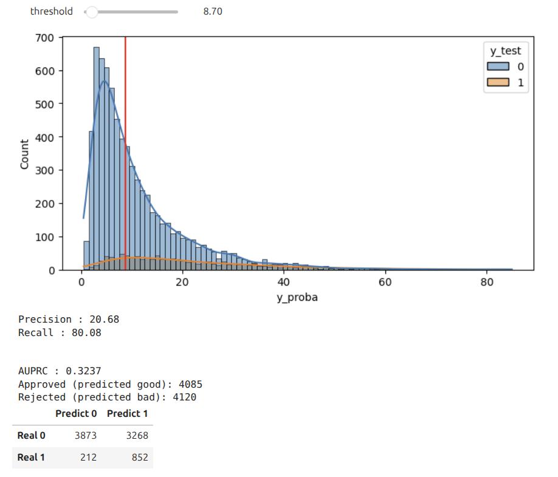

# Bad Loan Prediction

In this project we will try to predict flag bad based on several features. We will also do lot of feature engineering. 

### Slides

[View Presentation](https://docs.google.com/presentation/d/1bTWVKUndCJmqCgKBjqZI0zwOdDYtS8K9bzRzUUV4K6w/edit?usp=sharing)

### Files

In the project we have 3 main notebook:

- device.ipynb - Notebook for feature eningeering the device. Here we will curate data we have to match the gsmarena external dataset's model and oem key to gain more data.
- EDA.ipynb - Exploratory data analysis of the dataset. Here we unlock several pattern from the data.
- FE & Modelling.ipynb - In this notebook we try to do feature engineering and modelling to the dataset. We also try different model and also doing fine tuning to the model.

There are also several external data and curated data attached:

- convert.csv - data of conversion of codename to marketing name
- gsm.csv - gsmarena dataset we get from kaggle
- marketing_gsm_clean.csv - final curated data that has been joined that has key to our internal dataset

There are also archive datasets:

- phone_marketing_name_initial.csv - pre-curated dataset
- phone_marketing_name.csv - post-curated dataset

### Several Key Insights From EDA

- The discrepancies between the age based on FB date of birth relatife to date joined compared to de_age is affecting the flag bad composition.

- The difference of fb_gender and de_gender also increasing the bad composition relative to the non different one

- The more the children, the more flag bad composition

- And more at EDA.ipynb

### Modelling

We try to use xgboost and lightgbm model. After getting the best model, we continue to fine tune it.

### Evaluation

We will use area under precision recall curve to gain more insight to the data. After that we will take recall level by asumption and see the precision under threshold we take.

### Result

The AUPRC we get is around 0.31. We choose recall 80% and adjusted the threshold score. Out of 8205 sample, we reject 4120 people to maintain those recall by rejecting people having bad score more than 8.70.

### Deployment

To be continued.